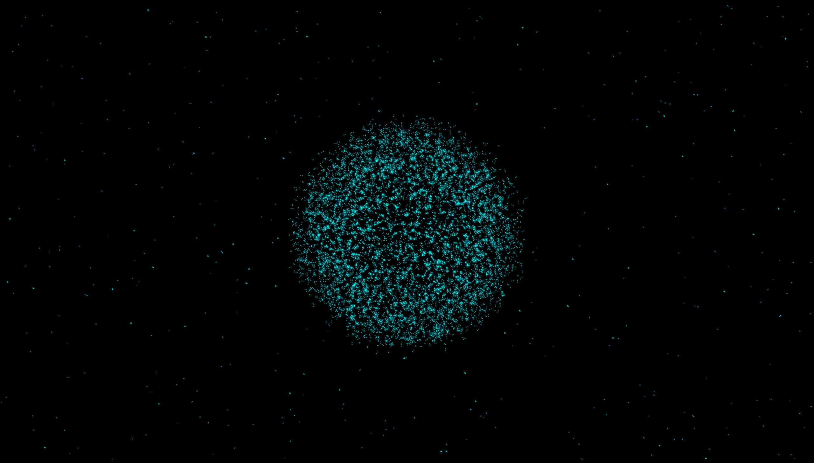

# Gesture Particle Sphere

这是一个 Python + MediaPipe + OpenCV + TouchDesigner 的手势粒子球项目。

本项目为复刻和学习用途，项目创意与效果并非原创。

项目通过 `gesture_sender.py` 使用摄像头和 MediaPipe 识别手势，并把运行状态写入 `gesture_state.txt`。TouchDesigner 工程 `gesture_particle_sphere_final.toe` 读取该运行时状态，用手势控制粒子球效果。

## English Introduction

This is an interactive gesture-controlled particle sphere project built with Python, MediaPipe, OpenCV, and TouchDesigner.

The Python script uses a webcam to detect hand openness and writes the gesture value to a local runtime file.

TouchDesigner reads that value and controls the particle sphere.

- Open hand: particles spread out.
- Half-closed hand: particles partially gather.
- Closed fist: particles gather into a glowing sphere.
- After the sphere is formed, it keeps a subtle rotating visual effect.

This project is for learning and recreation purposes. The visual concept is inspired by reference videos and is not claimed as original.

## Demo

[](demo.mp4)

Click the image above to watch the demo video.

## 运行环境

- Python 3.11
- TouchDesigner

## 运行说明

- Use Python 3.11.
- Do not use Python 3.14.
- Install dependencies with:

```bash
pip install -r requirements.txt
```

- Open `gesture_particle_sphere_final.toe` in TouchDesigner.
- Run:

```bash
python gesture_sender.py
```

- To stop the camera / gesture tracking script, return to the terminal and press:

```bash
Ctrl + C
```

- The script will exit safely and reset the gesture state value to 0.

## 文件说明

- `gesture_sender.py`: Python 手势识别与状态发送脚本
- `gesture_particle_sphere_final.toe`: TouchDesigner 粒子球工程文件
- `gesture_state.txt`: 运行时自动生成的状态文件，不提交到 Git
